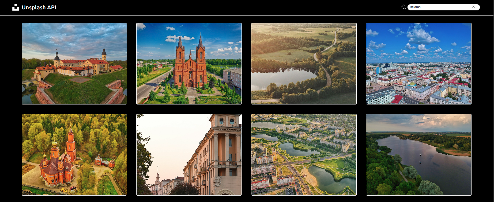

# Image Gallery

A responsive image gallery application built with vanilla JavaScript that searches and displays images from the Unsplash API.



## Features

- Search images from Unsplash API
- Responsive design for mobile and desktop
- Loading states and error handling
- Lazy loading for images
- Clean, modular architecture

## Technologies

- **Frontend**: Vanilla JavaScript, SCSS, HTML5
- **API**: Unsplash API
- **Build Tools**: ESLint, Prettier, Stylelint
- **Architecture**: Feature-based structure with separation of concerns

### Prerequisites

- Node.js installed on your machine
- Unsplash API access key

### Installation

1. Clone the repository
2. Install dependencies:
   ```bash
   npm install
   ```

### Running the Application

1. Compile SCSS to CSS:
   ```bash
   npm run scss
   ```

2. Start a local server:
   ```bash
   python3 -m http.server 8000
   ```
   or use any other static server

3. Open `http://localhost:8000` in your browser

### Development

To run the linters and code formatting:

```bash
npm run linters
```

To auto-fix linting issues:

```bash
npm run linters:fix
```

## Scripts

- `npm run scss` - Compile SCSS to CSS
- `npm run lint` - Run ESLint
- `npm run lint:fix` - Auto-fix ESLint issues
- `npm run format` - Format code with Prettier
- `npm run stylelint` - Check SCSS styles
- `npm run stylelint:fix` - Auto-fix SCSS issues
- `npm run linters` - Run all linters
- `npm run linters:fix` - Auto-fix all linter issues
